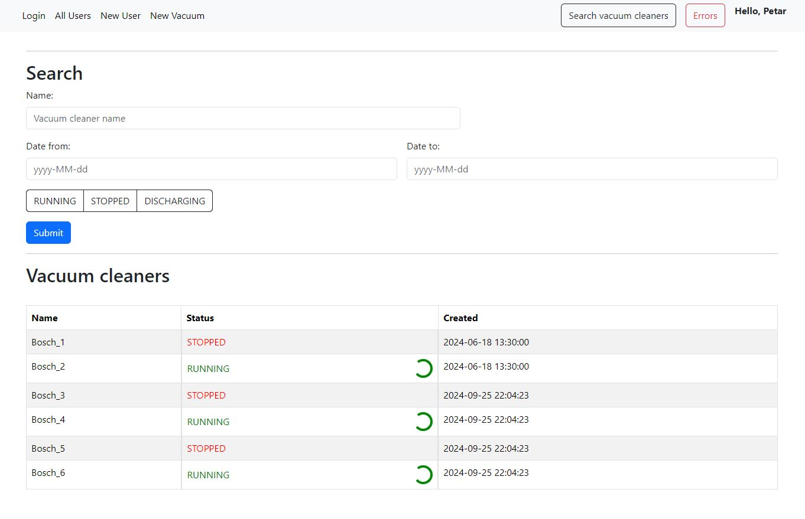
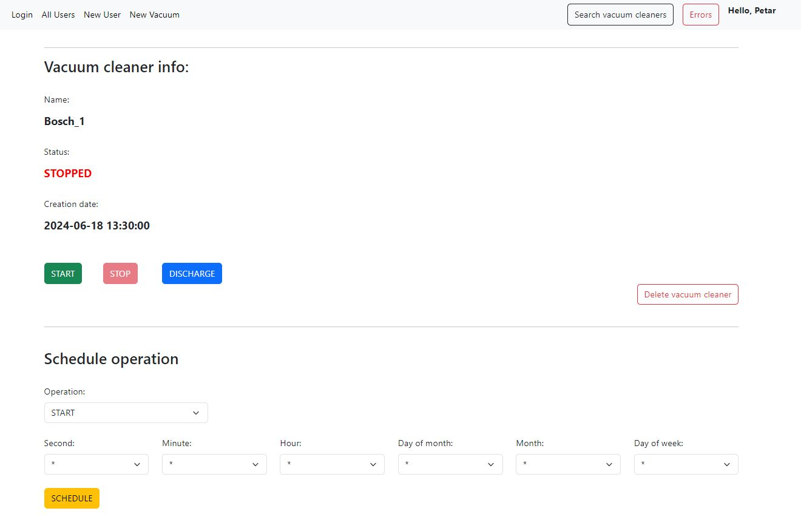

# Vacuum Control - Web Application

## Project Overview

Vacuum Control is a web application designed to simulate the control of robotic vacuum cleaners. The application allows users to add vacuums to the system, manage their states, and schedule operations like start, stop, and discharge. Additionally, the app provides detailed logging and error tracking for scheduled operations.

This project is split into two main modules:
1. **User Management** - Includes handling user creation, updating, deletion, and permissions management.
2. **Vacuum Control** - Allows users to control vacuum cleaners, schedule tasks, and manage their statuses.

### Key Features

- **User Management**: Full CRUD operations for user accounts with permission-based access control.
- **Vacuum Control**: Users can add, remove, start, stop, and discharge vacuums.
- **Scheduled Operations**: Schedule tasks for vacuums with logging and error tracking in case of failure.
- **Permission-based Actions**: All actions on vacuums (search, start, stop, discharge, add, remove) are based on user permissions.
- **Error Logging**: Display of error messages related to failed vacuum operations.

## Requirements

### Vacuum Entity

| Attribute | Type   | Description                             |
|-----------|--------|-----------------------------------------|
| id        | Long   | Unique identifier for the vacuum        |
| status    | Enum   | Current state of the vacuum (RUNNING, STOPPED, DISCHARGING) |
| user   | FK     | Reference to the user who added the vacuum |
| active    | Boolean| Whether the vacuum is currently active or not |
| created    | LocalDateTime| Time when vacuum was created |

### Vacuum Operations

- **Search**: Retrieve vacuums based on filters like name, status, and creation date.
- **Start**: Start a vacuum if it's stopped (takes 15+ seconds).
- **Stop**: Stop a running vacuum (takes 15+ seconds).
- **Discharge**: Discharge the vacuum when it is in the stopped state (takes 30+ seconds).
- **Add**: Add a new vacuum to the system (immediate action).
- **Remove**: Remove a vacuum from the system when it is stopped (immediate action).

## Technology Stack

### Backend:
- **Spring Framework**
- **MySQL Database**

### Frontend:
- **Angular**

## Frontend Features

1. **Vacuum Search**: Search vacuums based on filters (status, name, creation date, etc.).
2. **Add Vacuum**: A form to add new vacuums with only the name as input (other attributes are automatically filled in).
3. **Error History**: Display errors related to scheduled operations.



## User Management

- **JWT Authentication**: Secure login using JWT tokens stored in local storage.
- **Permissions**: Users are assigned specific permissions that control their ability to create, read, update, or delete other users.
- **User Operations**: 
  - Create, read, update, and delete users.
  - Permission-based access to user management features (e.g., users with no permissions cannot perform actions).
 
## Scheduling Operations

Operations like **START**, **STOP**, and **DISCHARGE** can be scheduled. If an operation fails, an error message is logged. Error logs are displayed on the error history page for the user who scheduled the operation.



## Setup and Installation

### Prerequisites

- **Java 8+**
- **Node.js** and **Angular CLI** installed for the frontend
- **MySQL Database**

### Backend Setup

1. Clone the repository:
    ```bash
    git clone https://github.com/pacimovic/Vacuum-control.git
    cd backend
    ```

2. Configure your **application.properties** file with your MySQL credentials:
    ```properties
    spring.datasource.url=jdbc:mysql://localhost:3306/vacuumcontrol
    spring.datasource.username=yourUsername
    spring.datasource.password=yourPassword
    ```

3. Run the application:
    ```bash
    ./mvnw spring-boot:run
    ```

### Frontend Setup

1. Navigate to the frontend folder:
    ```bash
    cd frontend
    ```

2. Install dependencies:
    ```bash
    npm install
    ```

3. Run the frontend:
    ```bash
    ng serve
    ```

The application will be accessible at `http://localhost:4200/`.

## Future Work

- **Real-time Updates**: Further improvement of real-time updates using WebSocket for more responsive feedback on operations.
- **Testing**: Comprehensive testing of the application is still pending and will be addressed in future iterations.
